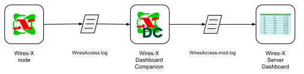

# WiresX Dashboard Companion

## Download
[Download here](https://github.com/stefanolande/wiresx_dashboard_companion/releases/latest/download/wiresx_dashboard_companion.zip)

## Description

WiresX Dashboard Companion is a software that work together with a WiresX node
and [WiresX Server Dashboard](https://www.grupporadiofirenze.net/2019/03/23/una-semplice-dashboard-per-nodi-wires-x-yaesu/).
The purpose of this software is to display in the WiresX Dashboard a list of passages in the XLX style, including those
that come from the Brandmeister Interlink.
Due to the design of the WiresX node, without this software the dashboard will only show the last passage from the
Interlink, regardless of the call sign.

WiresX Dashboard Companion works as follows:

- reads the `WiresAccess.log` file, where the WiresX node keeps track of passages
- writes the `WiresAccess-mod.log` file (configurable name), which will be used by the WiresX Server Dashboard to
  show the used

### Installation

- Download `wiresx-dashboard-companion.zip`
- Unzip it to a folder of your choice
- Edit the `wires_x_log` line in the `conf.toml` file, indicating the folder containing your
  file `WiresAccess.log`
- Edit the `write_log` line in the `conf.toml` file, setting it to the path and name where you want to same the modified
  log (I recommend naming the file `WiresAccess-mod.log` and using the same folder as the
  `WiresAccess.log` file)
- Edit the variable `$logFileName` in the WiresX Dashboard `index.php` file, setting the name and path of the
  modified log file (if you follow the previous suggestion just replace `WiresAccess.log` with `WiresAccess-mod.log`)
- Set Windows to start this software automatically (optional)

This program does not alter the personal configurations of the WiresX Server Dashboard in any way.
In case you need to restore
the previous display, simply close the software and edit `index.php` again by deleting
"-mod" in order to have the log created directly read by the WiresX software.

## Italiano

WiresX Dashboard Companion è un programma che lavora insieme ad un nodo WiresX
e [WiresX Server Dashboard](https://www.grupporadiofirenze.net/2019/03/23/una-semplice-dashboard-per-nodi-wires-x-yaesu/).
Lo scopo del programma è mostrare nella dashboard un elenco dei passaggi in stile XLX, compresi tutti i passaggi
provenienti dall'interlink con Brandmeister.
A causa del design del nodo WiresX, senza questo programma, la dashboard mostra solo l'ultimo passaggio proveniente dall'
interlink a prescindere dal nominativo.

WiresX Dashboard Companion funziona in questo modo:

- legge il file `WiresAccess.log`, dove il nodo WiresX tiene traccia dei QSO
- scrive un file `WiresAccess-mod.log` (nome configurabile), che sarà utilizzato da WiresX Server Dashboard per
  mostrare i QSO

### Installazione

- Scaricare il file `wiresx-dashboard-companion.zip`
- Decomprimerlo in una cartella a piacere
- Modificare nel file `conf.toml` la riga `wires_x_log`, indicando la cartella contenente il vostro
  file `WiresAccess.log`
- Modificare nel file `conf.toml` la riga `write_log`, indicando il nome del file e la cartella dove salvare il file di
  log modificato (consiglio di chiamare il file `WiresAccess-mod.log` e di utilizzare la stessa cartella del
  file `WiresAccess.log`)
- Modificare la variabile `$logFileName` nel file `index.php` di WiresX Dashboard, indicando il nome e percorso del
  file modificato (se hai seguito il suggerimento precedente basta sostituire `WiresAccess.log` con `WiresAccess-mod.log`)
- Impostare Windows per avviare il programma in automatico (opzionale)

Il programma non altera in nessun modo le configurazioni personali di WiresX Server Dashboard.
Nel caso in cui si ha la necessità di ripristinare
la precedente visualizzazione, sarà sufficiente chiudere il software e modificare nuovamente `index.php` cancellando
"-mod" al fine di far leggere il log creato direttamente dal software WiresX.